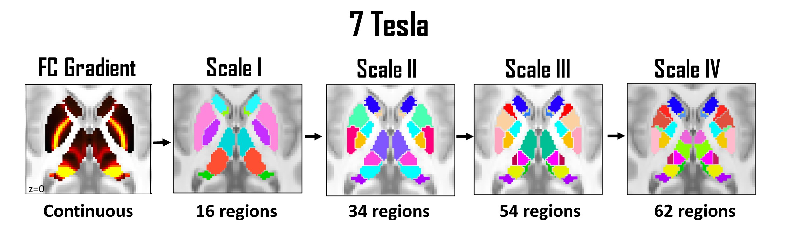

We are delighted to provide the neuroscience community with a new hierarchical MRI atlas of the human subcortex. This repository provides the new atlas for download and stores the code that was used to map the atlas. 

**I just want the atlas! Where can I find it?** Go to the [Subcortex-Only](/Group-Parcellation/3T/Subcortex-Only/) folder. There you will find the group-consensus atlas in NIFTI and CIFTI format for download. To make it convenient for you to map whole-brain connectomes, the atlas is also integrated into several well-known cortex-only parcellation atlases and the combined cortex-subcortex atlases can be found in the [Cortex-Subcortex](/Group-Parcellation/3T/Cortex-Subcortex/) folder. Continue reading below for further details and FAQs. 

**Atlas features:** 
- Volumetric parcellation of the human subcortex representing consensus among more than 1000 healthy adults.
- Available in four hierarchical scales as well as 3 and 7 Tesla versions. 
- Personalizable to represent individual variation in regional boundaries.
- Seamlessly integratable into established cortex-only parcellation atlases.
- Includes subdivisions of the striatum, thalamus, hippocampus, amygdala and globus pallidus. 

**Downloading the atlas:** The group-consensus atlas is provided in NIFTI and CIFTI (dlabel and dscalar) format for download in the [Group-Parcellation](/Group-Parcellation/) folder. If you are only here to download the atlas, this is the only directory that you need to visit. The atlas is delineated in 6th generation MNI space. This is the same space used by the HCP. To facilitate whole-brain connectome mapping, the 3T version of the atlas is also integrated into several existing cortex-only parcellation atlases and the combined cortex-subcortex atlases are provided for download in CIFTI format. A naming convention (anatomical nomenclature) for all regions is provided in a text file that accompanies each atlas scale.   

**Atlas scales:** The atlas is available in four scales, labeled Scales I, II, III and IV. Scale I is the coarsest atlas and recapitulates 8 well-known anatomical nuclei, while Scale IV is the finest and delineates 27 bilateral regions of the subcortex. Each scale is bilaterally symmetric and defines a self-contained parcellation atlas. 

**What atlas scale should I choose?** This depends on the purpose for which you intend to use the atlas. The functional connectivity architecture of the subcortex is inherently hierarchical. Atlas scales recapitulate distinct levels of the hierarchy.  If you intend to incorporate the atlas into an existing cortex-only atlas, choose a scale that is commensurate with the cortex-only atlas in terms of the number of regions. Higher scales delineate finer subcortical structrues and thus comprise more regions, as shown in the below table. 

|            | Scale I    | Scale II   | Scale III  | Scale IV   |
| ---------- | ---------- | ---------- |----------  | ---------- |
| 3 Tesla    | 16 regions | 32 regions | 50 regions | 54 regions |
| 7 Tesla    | 16 regions | 34 regions | 54 regions | 62 regions |

**Should I choose the 3T or 7T version?** 7T fMRI can alleviate some of the technical challenges inherent to subcortical imaging. The 7T version of the atlas delineates finer structures and thus comprises more regions at higher scales. The 7T version is sampled at a voxel resolution of 1.6mm, whereas the 3T version is sampled at 2mm. We recommend using the 3T version of the atlas with 3T fMRI data and likewise for the 7T version.

**How was the atlas mapped?** The guiding principle was reconciliation of two seemingly contradictory representations of brain topography: i) hard boundaries between discrete regions; and, ii) continuous spatial gradients. Laplacian eigenmaps were used to represent spatial gradients in resting-state functional connectivity across the subcortical volume. An analogue of diffusion MRI tractography, called *gradientography*, was developed to identify and parameterize gradient magnitude peaks in these spatial gradients. Formal model selection and null hypothesis testing was then used to determine whether gradient magnitude peaks were sufficiently large to warrant boundary delineation. This process was repeated recursively for each new region delineated, until the null hypothesis of an absence of boundaries could not be rejected for any region. In this way, boundaries are only delineated when justified by model selection and spatial variation is represented as a continuum (gradient) when boundary delineation is not warranted. 

**Why only four atlas scales?** The null hypothesis of an absence of boundaries could not be rejected for any of the regions comprising the Scale IV atlas, and thus further (finer) parcellation was not warranted. Specifically, gradient magnitude peaks at Scale IV were not significantly larger than that predicted by a null model.

**Why does the subcortex volume differ slightly between CIFTI and NIFTI files?**  To minimize partial volume effects, the volumetric mask used to define subcortical voxels is slightly more conservative than the FreeSurfer subcortical mask. However, the mask also very slightly exceeds the Freesurfer mask for some striatal regions. To conform with the HCP, the atlas provided in CIFTI format is cropped (i.e. voxels exceeding the FreeSurfer mask are removed) to ensure that it entirely resides within the FreeSurfer mask. The atlas provided in NIFTI format is not cropped. Cropping eliminated less than 1% of subcortical voxels in the original mask.  

**What are limitations of the atlas?** The new atlas is one of the best performing when benchmarked against alternative fMRI parcellations of the subcortex, using parcel homogeneity and other validation measures to quantify performance. However, it is important to note that subcortical MRI is particularly challening due to relatively low signal-to-noise ratios and other technical difficulties. While we have developed advanced image processing techniques to alleviate some of these challenges, subcortical fMRI is unlikely to achieve the same fidelity of cortical fMRI, particuarly when using single-echo fMRI acqusitions. 

**To smooth or not?** Spatial smoothing of fMRI data can be detrimental. Given the relatively low signal-to-noise ratio of the subcortex, we minimally smoothed the fMRI data before mapping the atlas (FWHM: 4-6mm). We recommend minimal spatial smoothing of the subcortical fMRI data before connectome mapping.    

**How can I personalize the atlas?** We have trained machine learning classifiers to recognize each region comprising the Scale IV atlas. This enables personalized atlases to be mapped for each individual, where regional boundaries can vary between individuals. However, further work is needed to evaluate how well the classifiers generalize to non-HCP fMRI data. The group-consensus atlas should be sufficient for most applications. Further details about personalization can be found in the [Individual-Parcellation](/Individual-Parcellation/) folder. 

**Contact us**

- Ye Tian:  yetianmed@gmail.com
- Andrew Zalesky: azalesky@unimelb.edu.au

Other contributors: Daniel Margulies and Matthew Glasser 

***

## Data and Code

The rest of this document is sectioned according to folders in this repository. Each folder corresponds to a key processing step in the pipeline used to map the new atlas.

The minimally pre-processed MRI data used for this project can be downloaded from [ConnectomeDB](https://db.humanconnectome.org/app/template/Login.vm). 

[**demo.m**](/demo.m) provides a demonstration of the overall pipeline and shows how the different steps fit together. This should be your first port of call. 

Auxiliary functons are stored in the [functions](/functions/) folder. This folder should be added to your MATLAB path. To enable running particular steps of the pipeline in isolation, we provide MATLAB data files (*.mat) that store several intermediate variables. These files are too large to store here, but can be downloaded from:

- [x.zip](http://www.connectome.org.au/subcortex/x.zip)
- [savg.zip](http://www.connectome.org.au/subcortex/savg.zip)
- [REST2_001_s.zip](http://www.connectome.org.au/subcortex/REST2_001_s.zip)
- [subcortex_mask_part1_Average_Vn2_VectorFile.zip](http://www.connectome.org.au/subcortex/subcortex_mask_part1_Average_Vn2_VectorFile.zip)
- [subcortex_mask_part1_track_distance.zip](http://www.connectome.org.au/subcortex/subcortex_mask_part1_track_distance.zip)

### MapGradient

   Compute Laplacian eigenmaps to represent spatial gradients in resting-state functional connectivity across the subcortical volume.

### fMRI-tractography

   Identify peaks in the gradient magnitude images using an analogue of diffusion MRI tractography called *gradientography*, also known as fMRI tractography. Gradientography enables parameterization of the gradient magnitude images in terms of curvilinear trajectories through the subcortical volume. 

### GeoNull

   Model selection: Use a geometry-preserving null model to test the null hypothesis that gradient each magnitude peak is not significantly larger in magnitude than what could be expected due to chance and/or the effects of geometry. A regional boundary is delineated at the location of gradient magnitude peaks for which the null hypothesis can be rejected. Spatial variation is represented as a continuum when the null hypothesis cannot be rejected. 

### Group-Parcellation

   This folder stores the group-consensus atlas in NIFTI and CIFTI format for download. 

   **/3T/Subcortex-Only/:**  3 Tesla version of the group-consensus atlas.
   
   **/3T/Cortex-Subcortex/:** 3 Tesla version of the atlas incorporated into the Glasser and Gordon cortical atlases, yielding combined cortex-subcortex atlases. 

   **7T:** 7 Tesla version of the group-consensus atlas. 

### Homogeneity

   Compute the parcel homogenenity of the new atlas and other measures of validation to quantify atlas performance. 

### Individual-Parcellation

   Personalize the atlas using support-vector machine learning to account for individual variation in regional boundaries. 
   
### Behavior

   Decompose high-dimensional behavioral data for HCP participants into 5 behavioral dimensions using independent component analysis (ICA). Due to participant data access restrictions imposed by the HCP, the behavioral dimensions cannot be made publicly available. Please contact us for further information.  
   
   ***

 

 
